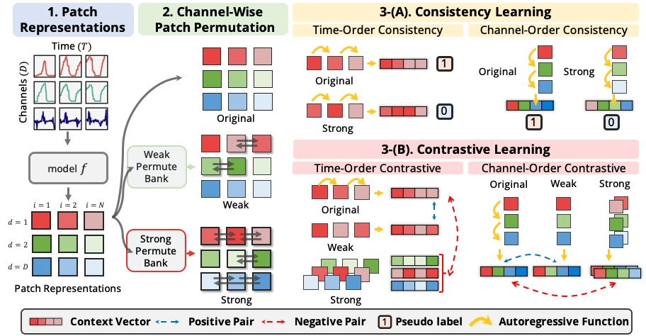

# PPT: Patch order Do Matters in Time Series Pretext Task 


## Explanation of Overview Figure
**PPT** employs three primary components: (1) Patch Representations, time series patches are encoded into latent patch representations; (2) Channel-Wise Patch Permutation, permuting patch orders channel-wise with permutation intensity governed by weak or strong criteria; (3-A) Consistency Learning, an autoregressive approach for recognizing patch order at both time and channel levels, paired with (3-B) Contrastive Learning to distinguish between original/weakly permuted (positive) and strongly permuted (negative) patches of sequences. For the negatives in contrastive learning, we use strongly permuted sequences from all channels. 

## Introduction
This is the code implementation of our paper: PPT: Patch order Matters in Time Series Pretext Task. All codes are implemented with `PyTorch Lightning==2.1.3` and `hydra-core==1.3.2`. 

## Installation
Install the following dependency. 
```bash
pip install -r requirements.txt
```
The main dependency are the following. We plan to deploy the `permutation` operation and `acf-cos` calculation as pip modules in the near future.
```bash
torch==2.0.1
pytorch-lightning==2.1.3 #Trainer module
hydra-core==1.3.2 # argparser.
```

## src
The `src` folder contains essential subdirectories utilized for both supervised and self-supervised training approaches.

- `data`: Hosts raw and preprocessed datasets.
- `dataset`: Includes PyTorch dataset classes.
- `layers`: Implements necessary layers for `PatchTST` and `PITS`.
- `loss`: Contains `consistency` and `contrastive` loss modules, along with patch shuffling operations.
- `shuffled_idx`: Stores permuted index dictionaries.

## PPT_Supervised
This repository is dedicated to the Supervised Training Scenario, integrating SSL (Self-Supervised Learning) Losses with traditional Cross-Entropy loss.

- `supervised_conf`: Configuration files in YAML format.
- `supervised_light_model`: PyTorch Lightning trainer classes.
- `supervised_models`: Contains backbone models for training.
- `supervised_outputs`: Directory where outputs are stored.
- `supervised_scripts`: Scripts necessary for executing all experiments associated with this project.
- `supervised_utilities`: Utility modules supporting supervised training.
- `supervised_weights`: Directory for storing trained model weights.

### Example code for supervised training.
Run the supervised training experiment on the `ptb` dataset with the following settings: a patch size of length 10 and outputs saved to the automatically created directory `supervised_outputs/EXP9999`.
```bash
python main_supervised.py data=ptb model=patchtst data.validation_cv_num=0 \
                gpu_id=0 light_model=light_patchtst_permute exp_num=9999 \
                model.patch_len=10 model.stride=10\
                light_model.optimizer.lr=0.002 \
                permute_test.patch_size_sets=[10] \ # Size of patches in permuted test set.
                permute_test.perform_test_on_permute_sets=True \ # Perform test on permuted test set.
                shuffler.permute_freq=10 \ # This sets the lower bound for strong permutation frequency.
                model.pe=sincos model.d_model=128 model.n_heads=8 model.n_layers=3 \
                task.limit_train_batches=1.0 \ # Use full dataset.
                light_model.ssl_loss.use_awl_loss=True \ # Use uncertainty weighted loss
                light_model.ssl_loss.use_consistency_loss=True  \
                light_model.ssl_loss.use_margin_loss=True  \
                light_model.callbacks.patience=3 \
                light_model.dataset.batch_size=128 seed=2020 deterministic=True
```

## PPT_SelfSupervised
This repo contains the Self-Supervised Training Scenario, where there is
- `main_pretrain.py` pretrains and saves the model,  and performs **linear probing** after the training. 
- `main_finetune.py` can either
    1. Train from scratch (random init) and perform full-finetuning.
    2. Load pretrained weight that was saved from `main_pretrain.py` and perform full-finetuning.

- `ssl_conf`: Configuration files in YAML format.
- `ssl_light_model`: PyTorch Lightning trainer classes.
- `ssl_models`: Contains backbone models for training.
- `ssl_outputs`: Directory where outputs are stored.
- `ssl_scripts`: Scripts necessary for executing all experiments associated with this project.
- `ssl_utilities`: Utility modules supporting ssl training.
- `ssl_weights`: Directory for storing trained model weights.


### Example code for self-supervised training.
Run the self-supervised training experiment on the `ptb` dataset with the following settings: a patch size of length 6 and outputs saved to the automatically created directory `ssl_outputs/EXP9999`.

```bash
python main_pretrain.py data=ptb model=patchtst data.validation_cv_num=0\
                gpu_id=0 light_model=light_patchtst_pretrain_permute exp_num=9999 \
                model.patch_len=6 model.stride=6 \
                model.d_ff=64 \
                light_model.optimizer.lr=0.001 \
                shuffler.permute_freq=40 \
                model.pe=sincos model.d_model=64 model.n_heads=4 model.n_layers=3 \
                light_model.ssl_loss.use_awl_loss=True \
                light_model.ssl_loss.use_consistency_loss=True  \
                light_model.ssl_loss.use_margin_loss=True  \
                light_model.callbacks.max_steps=1000 \
                save_pt_file=True \
                light_model.dataset.batch_size=32 seed=2020 deterministic=True &
```